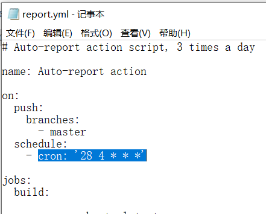
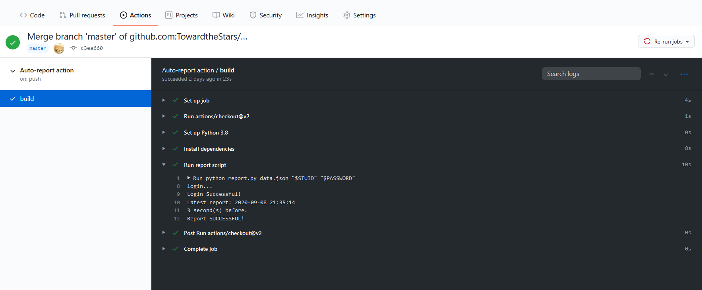

# 中国滑稽大学(University of Ridiculous of China)健康打卡平台自动打卡脚本


## 说明

**本打卡脚本仅供学习交流使用，请勿过分依赖。开发者对使用或不使用本脚本造成的问题不负任何责任，不对脚本执行效果做出任何担保，原则上不提供任何形式的技术支持。**

## 更新记录

- 20200910：更新使用方法

## 使用方法

0. **写在前面：请在自己fork的仓库中修改，并push到自己的仓库，不要直接修改本仓库，也不要将您的修改pull request到本仓库（对本仓库的改进除外）！如果尚不了解github的基本使用方法，请参阅[使用议题和拉取请求进行协作/使用复刻](https://docs.github.com/cn/github/collaborating-with-issues-and-pull-requests/working-with-forks)和[使用议题和拉取请求进行协作/通过拉取请求提议工作更改](https://docs.github.com/cn/github/collaborating-with-issues-and-pull-requests/proposing-changes-to-your-work-with-pull-requests)。**

1. 将本代码仓库fork到自己的github。

   1. 
   2. 点击 fork 按钮后，github 需要一点时间来完成 fork 操作。
   3. fork 之后，检查上图中左上角的用户名是否已变为自己的用户名（即当前的 repo 是否为自己 fork 出来的），如果是，则 fork 成功。

2. 默认的`data.json`是东区正常在校。也可以根据自己的实际情况修改`data.json`的数据，参看下文。

3. 点击Actions选项卡，点击 `I understand my workflows, go ahead and enable them`.

4. 点击 Settings 选项卡，点击左侧 Secrets，点击 New secret，创建名为 `STUID`，值为自己学号的 secret。用同样方法，创建名为 `PASSWORD`，值为自己中国滑稽大学统一身份认证密码的 secret。这两个值不会被公开。

   

5. 默认的打卡时间是每天的中午12:28，可能会有数分钟的浮动。如需选择其它时间，可以修改`.github/workflows/report.yml`中的`cron`。请注意这里使用的是**国际标准时间UTC**，北京时间的数值比它大8个小时。建议修改默认时间，避开打卡高峰期以提高成功率。
 
   

   这里 cron 的第一个数字为分钟数，第二个数字为小时（24小时制，零时区）。

6. 在Actions选项卡可以确认打卡情况。如果打卡失败（可能是临时网络问题等原因），脚本会自动重试，五次尝试后如果依然失败，将返回非零值提示构建失败。

   1. 如果成功打卡，Actions 的日志会有如下显示：
   2. 如果未显示 `Login Successful!` 则说明账号密码错误，需要用户返回第5步修改统一身份认证的账户和密码。
   3. 如果未显示 `Report SUCCESSFUL!` 则说明 `data.json` 中的数据有误，请自行根据 [data.json 数据获取方法](#data.json 数据获取方法) 一节修正 data.json 中的内容。

7. 将修改好的代码push至master分支。如果不需要修改 `data.json`，请在 `README.md` 里添加一个空格并push，否则不会触发之后的步骤。**请在自己的仓库中修改，不要pull request到本仓库！**

8. 在Github个人设置页面的Notifications下可以设置Github Actions的通知，建议打开Email通知，并勾选"Send notifications for failed workflows only"。

## 在本地运行测试

要在本地运行测试，需要安装python 3。我们假设您已经安装了python 3和pip 3，并已将其路径添加到环境变量。

### 安装依赖

```shell
pip install -r requirements.txt
```

### 运行打卡程序

```shell
python report.py [DATA] [STUID] [PASSWORD]
```
其中，`[DATA]`是存放打卡数据的json文件的路径，`[STUID]`是学号，`[PASSWORD]`是统一身份认证的密码明文。

## data.json 数据获取方法

使用 F12 开发者工具抓包之后得到数据，按照 json 格式写入 `data.json` 中。

1. 登录进入 `https://weixine.歪比巴卜.edu.cn/2020/`，打开开发者工具（Chrome 可以使用 F12 快捷键），选中 Network 窗口：


2. 点击确认上报，点击抓到的 `daliy_report` 请求，在 `Headers` 下面找到 `Form Data` 这就是每次上报提交的信息参数。


3. 将找到的 Data 除 `_token` （每次都会改变，所以不需要复制，脚本中会每次获取新的 token 并添加到要提交的数据中）外都复制下来，存放在 `data.json` 中，并参考示例文件转换为对应的格式。

4. 通过push操作触发构建任务，检查上报数据是否正确。

## 许可

MIT License

Copyright (c) 2020 BwZhang

Copyright (c) 2020 Violin Wang

Permission is hereby granted, free of charge, to any person obtaining a copy
of this software and associated documentation files (the "Software"), to deal
in the Software without restriction, including without limitation the rights
to use, copy, modify, merge, publish, distribute, sublicense, and/or sell
copies of the Software, and to permit persons to whom the Software is
furnished to do so, subject to the following conditions:

The above copyright notice and this permission notice shall be included in all
copies or substantial portions of the Software.

THE SOFTWARE IS PROVIDED "AS IS", WITHOUT WARRANTY OF ANY KIND, EXPRESS OR
IMPLIED, INCLUDING BUT NOT LIMITED TO THE WARRANTIES OF MERCHANTABILITY,
FITNESS FOR A PARTICULAR PURPOSE AND NONINFRINGEMENT. IN NO EVENT SHALL THE
AUTHORS OR COPYRIGHT HOLDERS BE LIABLE FOR ANY CLAIM, DAMAGES OR OTHER
LIABILITY, WHETHER IN AN ACTION OF CONTRACT, TORT OR OTHERWISE, ARISING FROM,
OUT OF OR IN CONNECTION WITH THE SOFTWARE OR THE USE OR OTHER DEALINGS IN THE
SOFTWARE.

